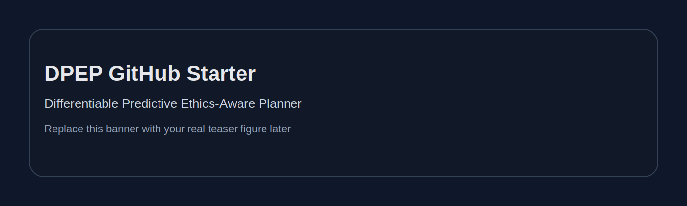
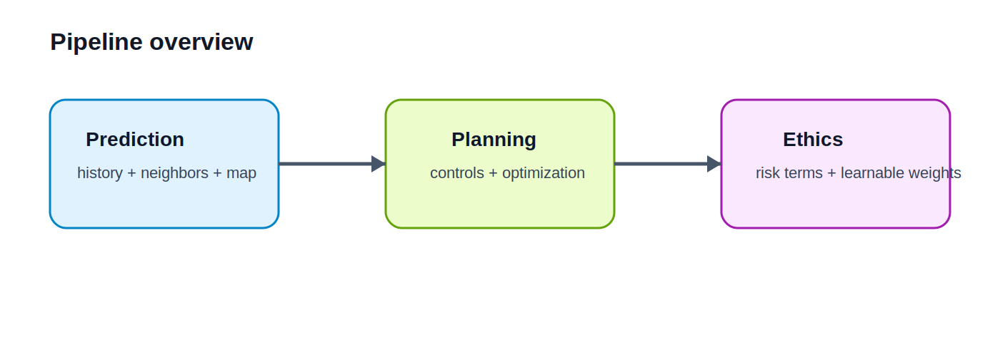

# DPEP: Differentiable Predictive Ethics-Aware Planner

A starter GitHub project template for an autonomous driving research repo focused on **ethics-aware prediction and planning**.



## What this repository is for

This repository is designed as a clean starting point for sharing:
- your model code
- training scripts
- planning modules
- experiment configs
- figures and results
- dataset notes
- reproducible instructions for others

This template is tailored to a project structure consistent with your current work: a predictor module, a differentiable motion planner, and a training pipeline, matching the core components shown in your uploaded code and draft manuscript. fileciteturn0file0 fileciteturn0file1 fileciteturn0file2 fileciteturn0file7

---

## Repository structure

```text
DPEP/
├── .github/
│   └── ISSUE_TEMPLATE/
├── assets/
│   └── images/
│       ├── banner.svg
│       ├── pipeline_overview.svg
│       └── repo_structure.svg
├── configs/
├── data/
│   ├── raw/
│   ├── processed/
│   └── sample/
├── docs/
├── notebooks/
├── results/
│   ├── checkpoints/
│   └── figures/
├── scripts/
├── src/
│   ├── models/
│   ├── planning/
│   └── utils/
├── tests/
├── .gitignore
├── LICENSE
├── requirements.txt
└── README.md
```

---

## Suggested purpose of each folder

| Folder | What to put here |
|---|---|
| `assets/images/` | Figures used in the README, pipeline diagrams, teaser images |
| `configs/` | Training and evaluation yaml/json config files |
| `data/raw/` | Raw downloaded data, never edited manually |
| `data/processed/` | Cleaned or converted data |
| `data/sample/` | Tiny demo files for quick examples |
| `docs/` | Project notes, method docs, dataset cards |
| `notebooks/` | Colab or Jupyter experiments |
| `results/checkpoints/` | Saved weights and model checkpoints |
| `results/figures/` | Output plots and evaluation figures |
| `scripts/` | Bash or Python helper scripts |
| `src/models/` | Predictor and network components |
| `src/planning/` | Motion planner and optimization code |
| `src/utils/` | Shared helper functions |
| `tests/` | Unit tests and sanity checks |

---

## Project overview



Your current project already has a natural three-part story for GitHub presentation:
1. **Prediction module** for multi-agent future forecasting. 
2. **Differentiable motion planner** with ethical risk terms and optimization. 
3. **Training pipeline** that jointly learns prediction and planning. 

That same structure is also reflected in the paper draft, where DPEP is presented as an integrated prediction-planning framework with learnable ethical weights. fileciteturn0file7

---


## Minimal TODO before publishing

- Replace `YOUR-USERNAME` and `YOUR-REPO-NAME`
- Add your real project title if you want a different name from DPEP
- Update the teaser banner in `assets/images/banner.svg`
- Add one real pipeline figure or screenshot
- Fill `requirements.txt`
- Add citation info when your paper is ready
- Decide whether to upload small sample data only

---

## Example sections you can expand later

### Method
Describe your predictor, planner, ethical cost functions, and training objective.

### Datasets
List the datasets you used, access instructions, and license restrictions.

### Training
Explain how to launch training, resume checkpoints, and evaluate results.

### Results
Show qualitative scenarios, risk plots, and comparison tables.

---

## Example training command

```bash
python train.py \
  --name dpep_experiment \
  --train_set ./data/processed/train \
  --valid_set ./data/processed/val \
  --batch_size 32 \
  --train_epochs 15
```

---


## License

Add your preferred license in `LICENSE`.

---

## Contact

- Rui Gan
- University of Wisconsin--Madison

